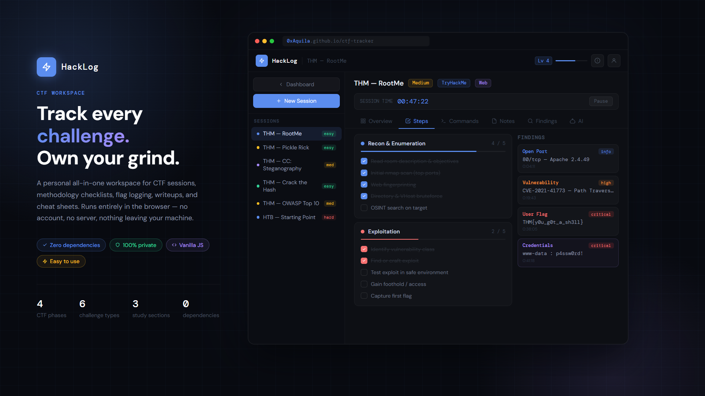
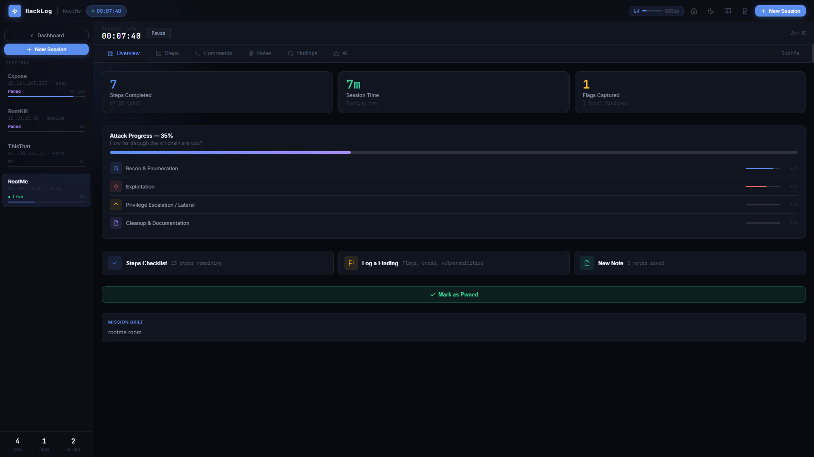
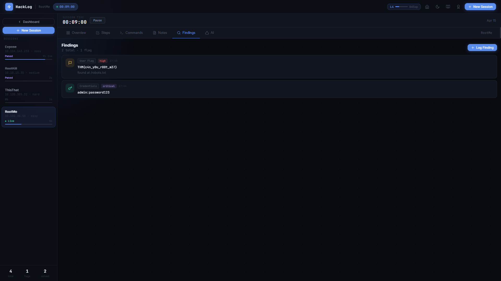
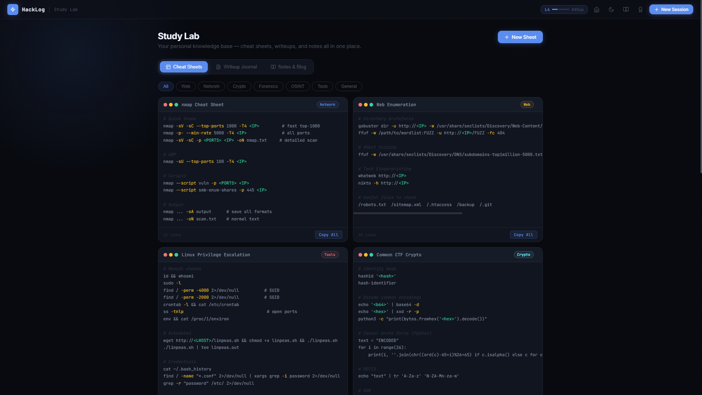
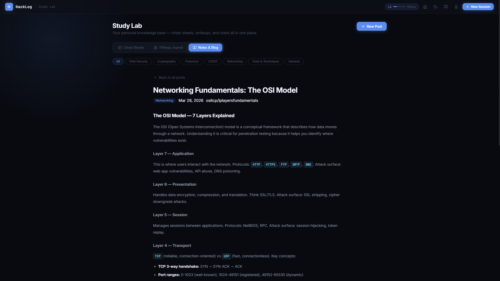
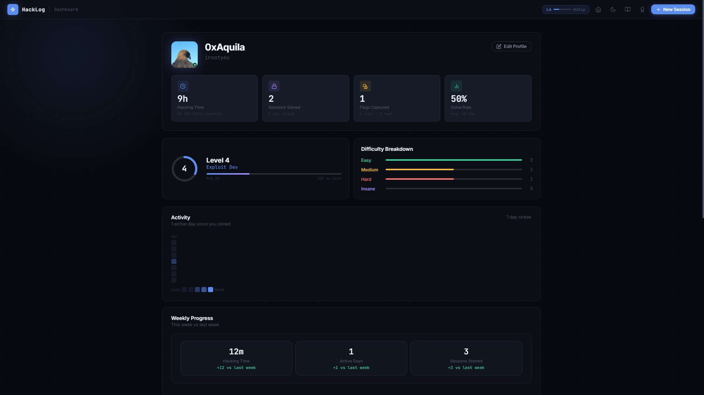
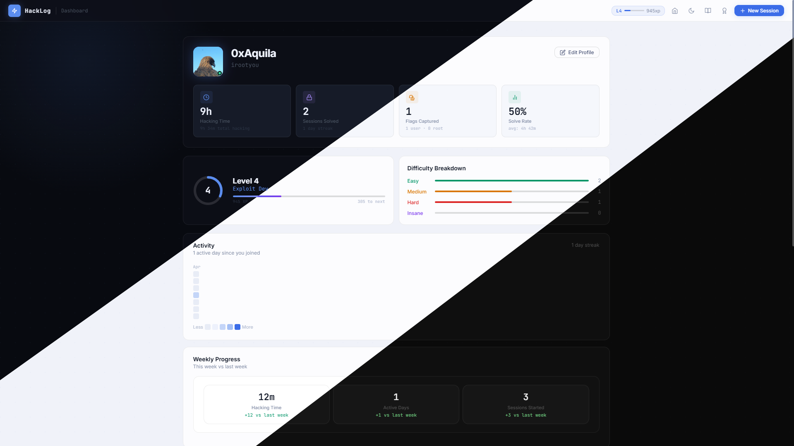

<div align="center">


<br/>

[](https://0xAquila.github.io/ctf-tracker)
&nbsp;&nbsp;
[](LICENSE)
&nbsp;&nbsp;
[]()
&nbsp;&nbsp;
[]()

</div>

---

<div align="center">

## The hacking workspace you always wanted — and never had to build.

*Track every challenge. Capture every flag. Study smarter. Level up.*

</div>

---



---

## Why HackLog?

Most CTF players track their work in scattered notes, random text files, or nothing at all. HackLog fixes that. It's a fully offline, single-file workspace that covers your entire hacking lifecycle — from the moment you start a challenge to the final writeup. No sign-up. No cloud. No nonsense. Just open it and get to work.

Built for **TryHackMe**, **HackTheBox**, and every CTF format in between.

---

## Feature Overview

<table>
<tr>
<td width="50%" valign="top">

### ⚡ Challenge Tracker
Start a session in seconds. Live timer, target metadata, and a full sidebar showing every active and completed challenge at a glance.

### ✅ Methodology Checklists
Four universal CTF phases — Recon, Exploitation, Privilege Escalation, Documentation — pre-loaded and ready. Plus type-specific sub-checklists for Web, Crypto, Forensics, OSINT, Network, and Misc.

### 🔍 Findings Logger
Log flags, credentials, hashes, CVEs, open ports, and notes as you find them. Colour-coded by type, severity-tagged, and timestamped automatically.

</td>
<td width="50%" valign="top">

### 🤖 AI Session Assistant
An AI assistant lives inside every session with full context of your checklist, findings, and notes. Ask it anything. Powered by the Groq API — free tier available.

### 📚 Study Lab
A three-section knowledge base: **Cheat Sheets** with syntax-highlighted code blocks, a **Writeup Journal** linked to your sessions, and a **Notes & Blog** for personal study posts.

### 🏆 Progression System
XP, levels, and achievements. A 90-day activity heatmap, skill ring breakdown, weekly stats, and a profile page that makes your growth visible.

</td>
</tr>
</table>

---

## See It In Action

### Challenge Session — Methodology Checklist

Every session comes with structured, phase-based checklists. Each item has a **hint tooltip** and **suggested tools** — so you always know your next move, even when you're stuck.



---

### Findings Logger — Never Lose a Flag Again

Log every discovery the moment you find it. Flags, credentials, password hashes, open ports, vulnerabilities — all colour-coded, severity-tagged, and timestamped.



---

### Study Lab — Build Your Knowledge Base

**Cheat Sheets** — a professional reference library with syntax-highlighted code, filterable by category. Four expert sheets pre-loaded. Build your own with the full-featured editor.



**Notes & Blogs** — keep all study info you need in one place.



---

### Profile & Progression

Your hacking journey, visualised. XP earned from every checklist item, flag, and solved challenge. A 90-day heatmap that shows your consistency. Skill rings breaking down your mastery across CTF phases. Weekly stats comparing you to last week.



---

### Three Themes — Pick Your Aesthetic

Switch between **Dark**, **Light**, and **Clean Dark** instantly. Every component, every colour, every detail adapts perfectly.



---

## Getting Started

### Use the live version

Head to **[0xAquila.github.io/ctf-tracker](https://0xAquila.github.io/ctf-tracker)** — no install, no account, works in any modern browser.

### Run it locally

```bash
git clone https://github.com/0xAquila/ctf-tracker.git
cd ctf-tracker
```

Then just open `index.html` — or serve it with any static server:

```bash
# Python
python3 -m http.server 8080

# Node (no install needed)
npx serve .
```

**That's it.** No `npm install`. No build step. No configuration. Zero dependencies.

---

## Tech Stack

The entire application is **three files**.

| File | Role |
|---|---|
| `index.html` | App structure — all views, modals, and navigation |
| `style.css` | Three complete themes, full component library, animations |
| `app.js` | All logic — data model, rendering, localStorage, XP system, AI |

No framework. No bundler. No runtime dependencies. The only external resource is Google Fonts over CDN.

```
ctf-tracker/
├── index.html
├── style.css
├── app.js
├── favicon.svg
└── README.md
```

---

## Your Data, Forever

Everything lives in your browser. Nothing is ever sent to a server.

| localStorage key | Contents |
|---|---|
| `hacklog_v1_targets` | Sessions — checklist state, findings, notes, timer |
| `hacklog_v1_sheets` | Cheat sheet library |
| `hacklog_v1_writeups` | Writeup journal entries |
| `hacklog_v1_blogs` | Notes & blog posts |
| `hacklog_v1_profile` | Handle, tagline, XP, level, achievements |
| `hacklog_v1_theme` | Active theme preference |

Hit **Export Data** on your dashboard at any time for a full JSON backup. Import it back just as easily.

---

## Roadmap

- [ ] Markdown preview in the notes editor
- [ ] Export individual writeup as `.md` or PDF
- [ ] Per-session time-on-task breakdown chart
- [ ] Full-text search across sessions, writeups, and cheat sheets
- [ ] Custom checklist items per session

---

## License

[MIT](LICENSE) — free to use, fork, and build on.

---

<div align="center">

**Built for hackers, by a hacker.**

*If HackLog helps you capture a flag, ⭐ the repo.*

</div>
